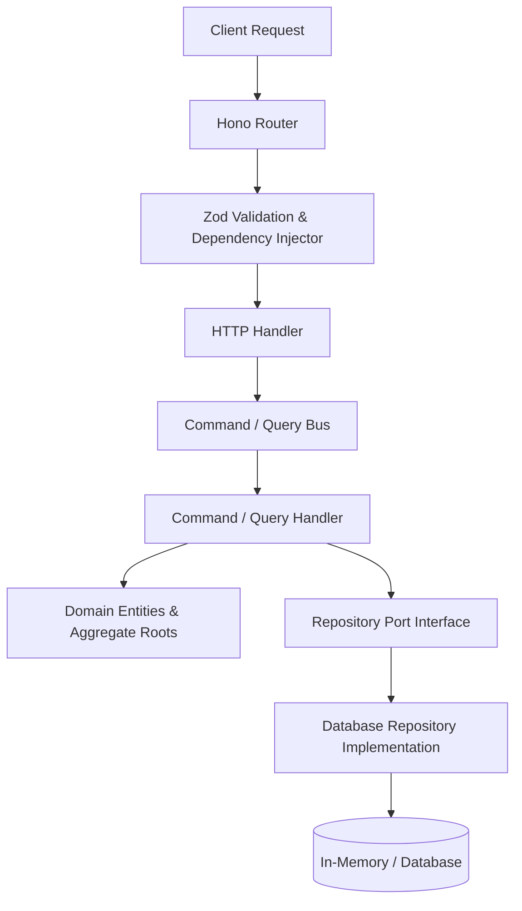

# ⚡ Bun Backend Starter

<div align="center">

[](https://bun.sh)
[](https://hono.dev)
[](https://www.typescriptlang.org/)
[](https://eslint.org/)
[](https://prettier.io/)
[](./AGENTS.md)

A modern, highly-opinionated backend starter template built for speed, type safety, and clean architecture. Powered by **Bun**, **Hono**, **TypeScript**, **TSyringe**, and designed around **DDD (Domain-Driven Design)** and **CQRS (Command Query Responsibility Segregation)** principles.

[Features](#-features) • [Architecture](#-architecture) • [Getting Started](#-getting-started) • [Directory Structure](#-directory-structure) • [Development Workflow](#-development-workflow) • [Scripts](#-available-scripts) • [AI Assistance](#-ai-coding-assistance)

</div>

---

## ✨ Features

- ⚡ **Ultra-Fast Runtime:** Built natively on **Bun** for rapid startup times and lightning-fast package management.
- 🔥 **Lightweight Routing:** Powered by **Hono** web framework, running anywhere Bun runs.
- 📐 **Domain-Driven Design (DDD):** Built-in abstractions for Entities, Aggregate Roots, Value Objects, and Mappers to keep business logic isolated.
- 🔀 **CQRS Pattern:** Separation of read queries and write commands using type-safe in-memory Command and Query buses.
- 💉 **Dependency Injection:** True Inversion of Control (IoC) with **TSyringe** for modular, testable, and loosely coupled services.
- 🛡️ **Bulletproof Validation:** Request body, query, and parameter schema validation using **Zod**.
- 🛠️ **Functional Error Handling:** Uses **Oxide.ts** to implement Rust-like type-safe `Result` types (`Ok`, `Err`), preventing unhandled exception escapes.
- 🔍 **Strict Code Quality:** Configured with [eslint-config-sheriff](https://www.eslint-config-sheriff.dev/) for high-standard TypeScript linting and Prettier for clean code format.

---

## 🏛️ Architecture & Patterns

The architecture of this starter template is designed to scale with large teams and complex business domains:



### Abstractions Layer (`src/lib/`)
- [**ddd/**](./src/lib/ddd) - Base classes for Entities, Aggregate Roots, Value Objects, and Repository ports.
- [**cqrs/**](./src/lib/cqrs) - Command and Query buses to decouple routing handlers from business logic handlers.
- [**http/**](./src/lib/http) - Customized router wrapper, HTTP middle-wares, logger middleware, and context injectors.
- [**exceptions/**](./src/lib/exceptions) - Common client and server exception types for graceful HTTP error mapping.

---

## 📁 Directory Structure

```
├── @types/              # Global type declarations
├── src/
│   ├── lib/             # Core library and structural abstractions
│   │   ├── config/      # Environment variables & schema configuration
│   │   ├── cqrs/        # In-memory command and query buses
│   │   ├── ddd/         # Base DDD structural entities & interfaces
│   │   ├── exceptions/  # Predefined client/server exceptions
│   │   └── http/        # Hono factories, router configurations, and middlewares
│   ├── modules/         # Feature modules containing business logic
│   │   └── book/        # Example 'Book' module (CQRS + DDD flow)
│   └── main.ts          # Application bootstrap and entry point
├── .env.example         # Environment variables template
├── eslint.config.ts     # Flat ESLint configuration (Sheriff)
├── tsconfig.json        # TypeScript compiler configurations
├── bun.lock            # Bun package lockfile
└── package.json
```

---

## 🚀 Getting Started

### Prerequisites

Ensure you have **Bun v1.3.8** or higher installed on your system.

```bash
bun --version
```

### Installation

1. **Clone the repository:**
   ```bash
   git clone https://github.com/fhrii/bun-backend-starter.git
   cd bun-backend-starter
   ```

2. **Install dependencies:**
   ```bash
   bun install
   ```

3. **Configure environment variables:**
   Copy the example environment file and adapt the variables:
   ```bash
   cp .env.example .env.local
   cp .env.example .env.development
   ```

---

## 🛠️ Development Workflow

### Creating a New Feature Module

To add a new feature domain (e.g., `User`):

1. **Create Directory:** Create `src/modules/user` and its subfolders:
   ```
   src/modules/user/
   ├── command/          # Commands modifying state (Create, Update, Delete)
   ├── query/            # Queries fetching state (Find, Search)
   ├── domain/           # Domain entity and error definitions
   ├── repository/       # Repository interface and implementations
   ├── dto/              # Request / Response Schemas
   ├── user.token.ts     # Injection tokens
   ├── user.router.ts    # Hono route endpoints
   ├── user.mapper.ts    # Mapping database/payloads to Domain/Responses
   └── user.module.ts    # Module entry class resolving commands/queries
   ```

2. **Register Module:** Register the new module in the application entry point `src/main.ts`:
   ```typescript
   import { UserModule } from './modules/user';
   
   const userModule = new UserModule();
   userModule.registerRoute(app);
   ```

### Running the App

- **Start dev server with hot reload:**
  ```bash
  bun run dev
  ```
- **Start production server:**
  ```bash
  bun run start
  ```

---

## 📜 Available Scripts

| Script | Command | Description |
| :--- | :--- | :--- |
| `dev` | `bun --env-file=.env.local --env-file=.env.development --watch src/main.ts` | Start dev server with hot-reloading |
| `start` | `bun --env-file=.env.production src/main.ts` | Start production server |
| `lint` | `eslint . --fix` | Format and lint all source code |
| `lint:check` | `eslint .` | Verify code style without modifying files |
| `clean` | `rimraf ./dist` | Delete the build/dist directory |

---

## 🤖 AI Coding Assistance

This project includes a dedicated [AGENTS.md](./AGENTS.md) file designed for AI coding agents and assistants. If you are using an AI coding assistant (like Antigravity, Github Copilot, Devin, or Cursor), it will automatically read the rules, boundaries, and patterns outlined in that file to ensure the code it writes is consistent with this repository's standards.

---

## 📝 License

This project is licensed under the [MIT License](LICENSE).
